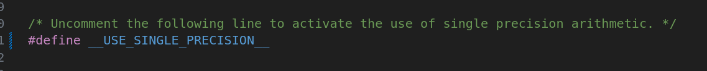
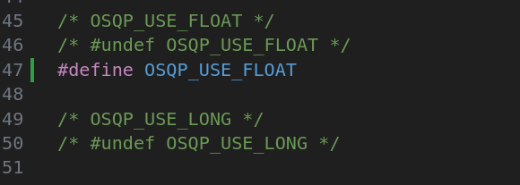
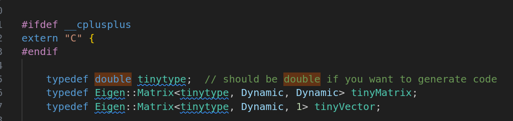

# controller_module
controller code library

### 接口描述

该仓库提供以下代码和接口：

1. Pid模块
2. Mpc模块
   - 基于Eigen的Mpc问题转换为QP问题计算库mpcMatrix
   - 基于qpOASES求解库的接口qpOASES_interface
   - 基于quadprog++求解库的接口quadprog_interface
   - 基于tinyMpc求解库的接口tinyMpc_interface
   - 基于osqp求解库的接口osqp_interface
   - 基于osqp-eigen求解库的接口osqpE_interface

### 类型对齐

#### Mpc

**接口类型配置**

config/mpcInterfaceCfg.h

**qpOASES类型配置**

include/qpOASES/Types.hpp

**osqp类型配置(同时影响osqp-eigen)**

include/osqp100/osqp/osqp_config.h

由于osqp在外部编译，因此切换数据类型需要重新编译静态库或者动态库

相关命令`cmake -DOSQP_USE_FLOAT=ON -DOSQP_USE_LONG=OFF -DCMAKE_BUILD_TYPE=Release ..`

**tinyMPC类型配置**

include/TinyMPC/types.hpp

**QuadProg默认使用double，因此使用float时请不要使用qp++求解库**
